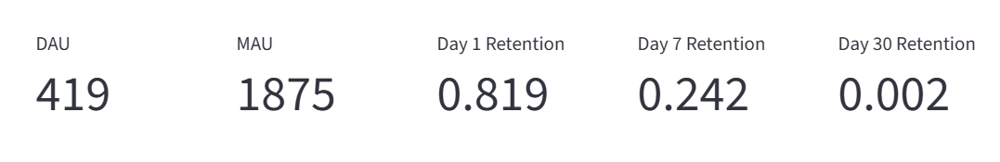
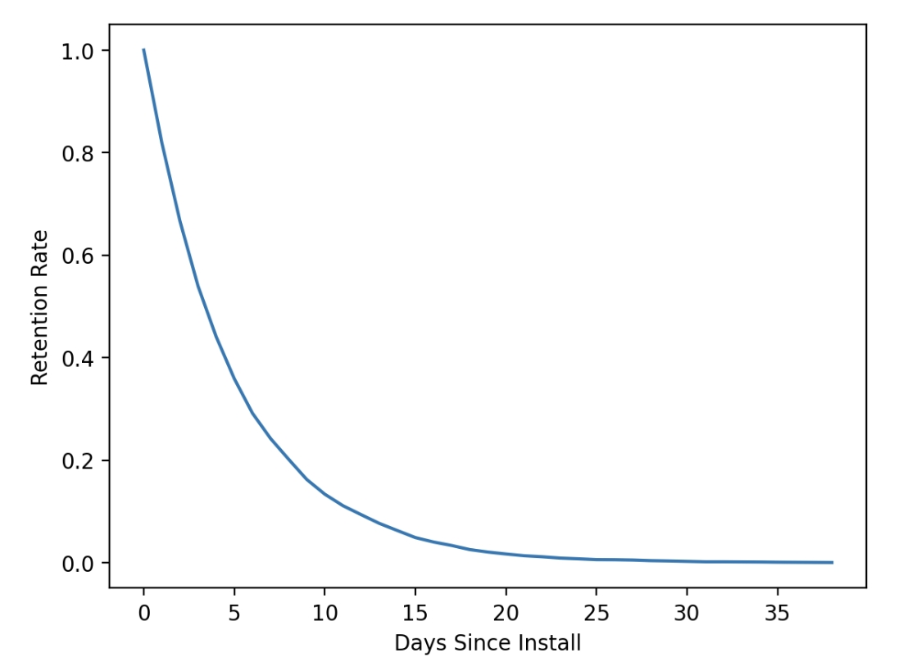
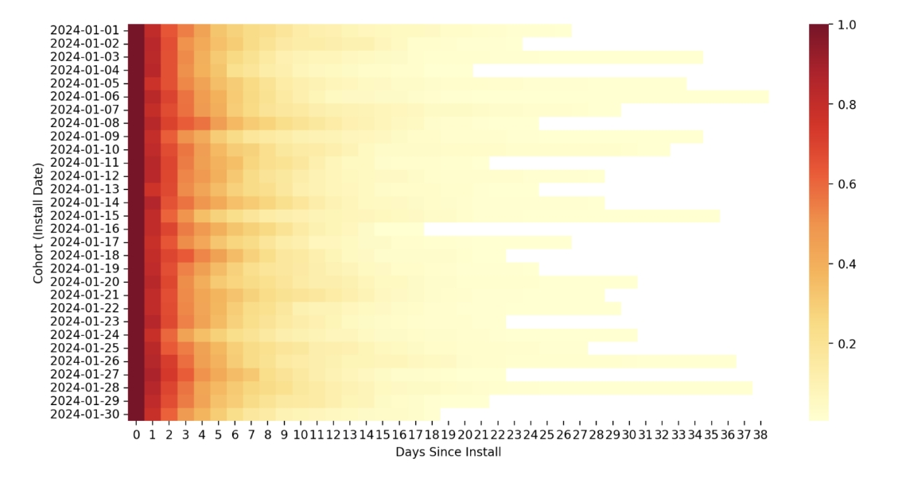
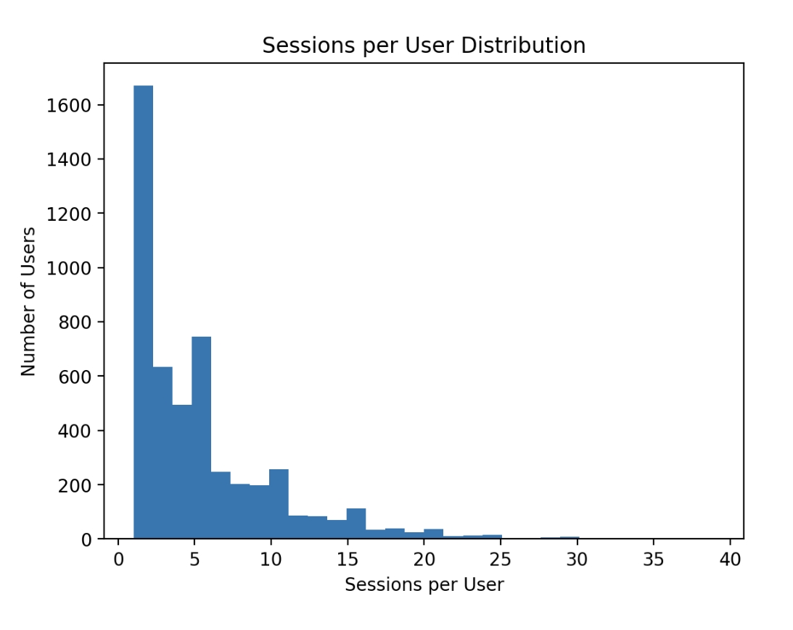
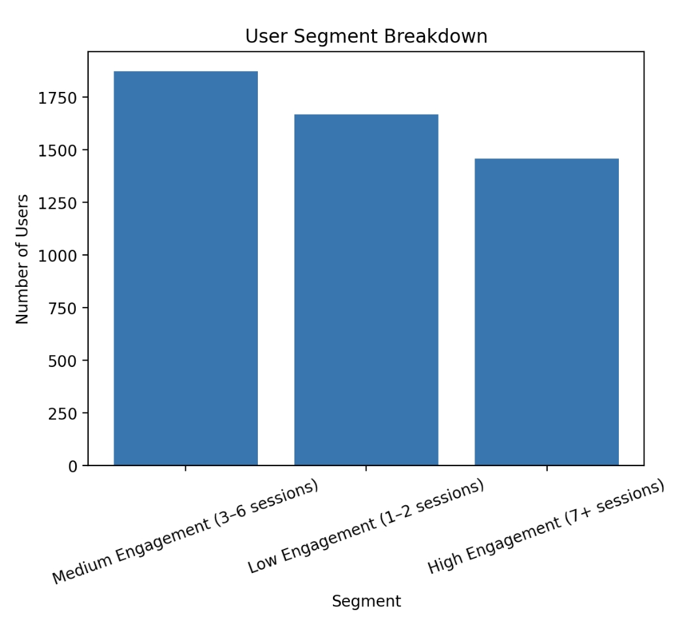
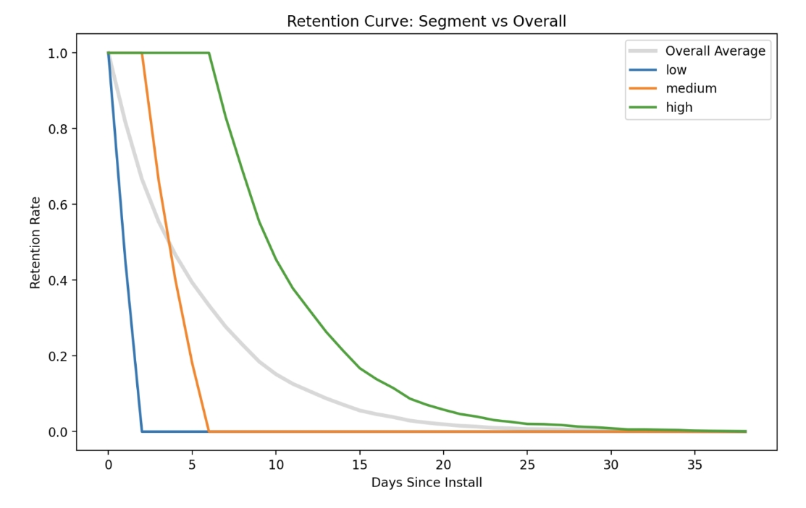

# 🎮 Mobile Game Retention \& Engagement Analysis


## 📌 Overview

This project analyzes player behavior in a mobile game, focusing on user retention, engagement patterns, and player segmentation using cohort analysis.


A Streamlit dashboard was built to visualize key metrics interactively.
### 📊 Dashboard Preview








---
## 📌 Data Source

The dataset used in this project is a publicly available mobile game analytics dataset sourced from Kaggle. 

It is a synthetic / simulated dataset created for learning and portfolio purposes, designed to mimic real-world mobile game user behavior including installs, sessions, and engagement events.

No personally identifiable or production user data is included.


## 📊 Key Metrics

- DAU / MAU

- D1 / D7 / D30 Retention

- Cohort Retention Curves

- Player Segmentation (Low / Medium / High Engagement)


---


## 📈 Insights

- Retention drops significantly within the first 2–3 days

- High-engagement users show much stronger long-term retention

- Player engagement is highly skewed, with a small core group driving activity


---


## 🧰 Tech Stack

- Python (Pandas, Matplotlib, Seaborn)

- Streamlit

- Jupyter Notebook


---


## 📊 Dashboard

Run locally:

```bash

streamlit run app.py

